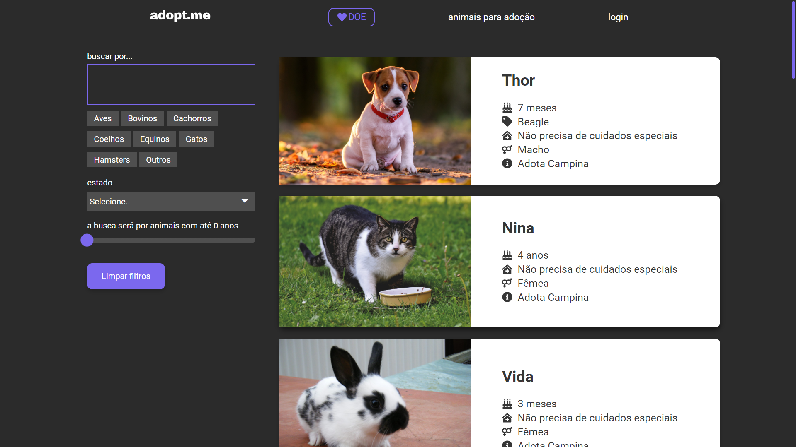
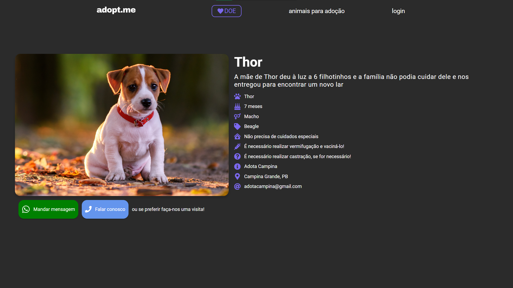
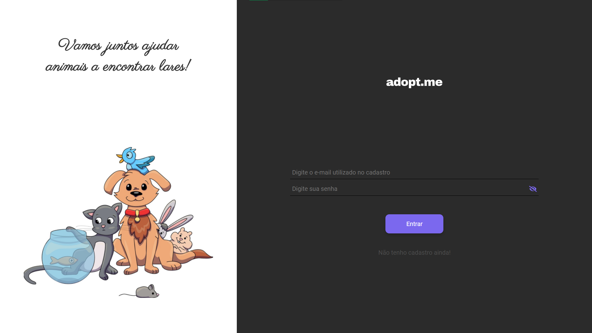
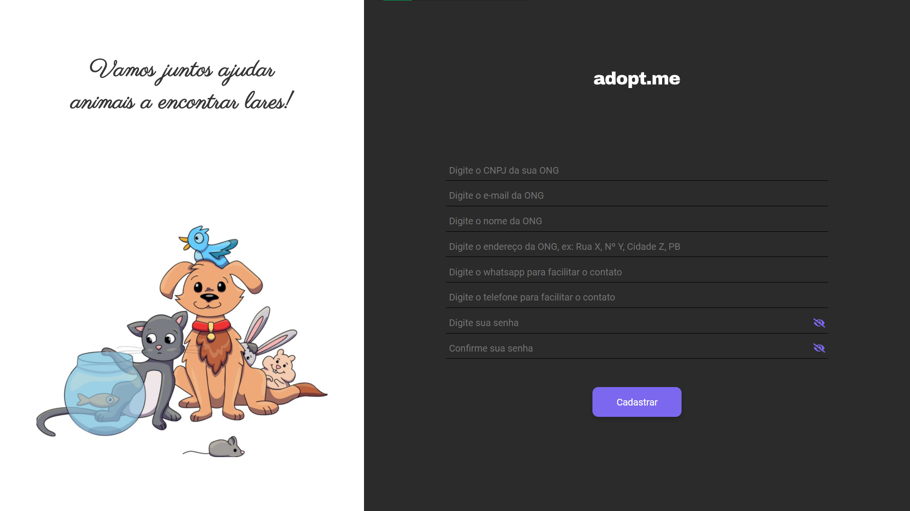
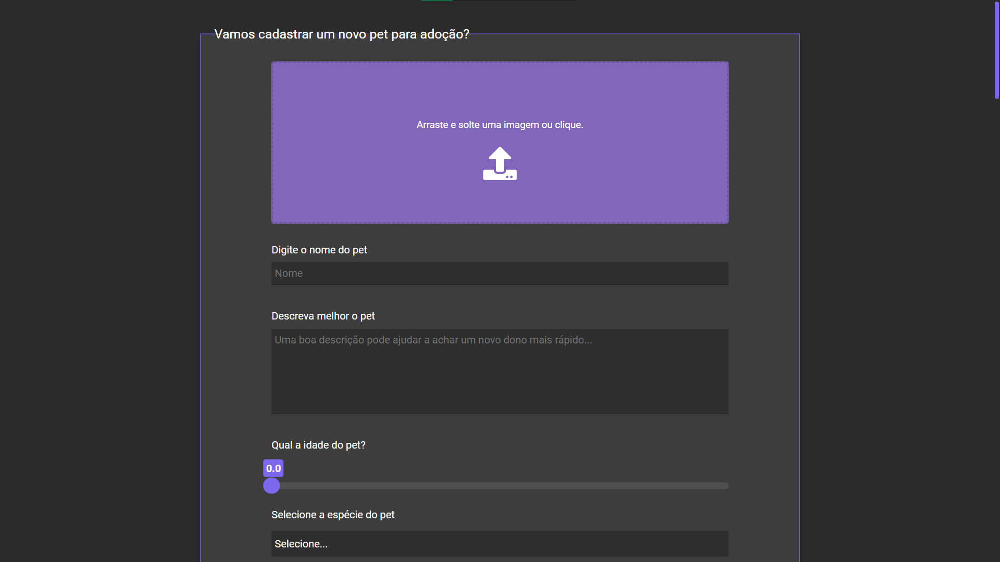

# 🐾 Front-end do adopte.me

O sistema possui 5 telas:
> em breve: prints das telas

1. Tela de listagem e filtragem de todos os animais adotáveis
  
2. Tela com os detalhes de cada animal da listagem
  
3. Uma tela de login para as ONG's
  
4. Uma tela de cadastro para as ONG's
  
5. Uma tela de cadastro de animais
  
